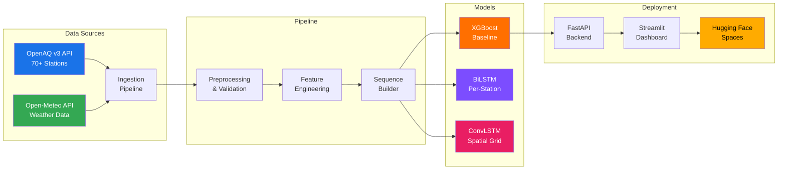

<h1 align="center">🌍 Spatio-Temporal Air Quality Forecasting</h1>

<p align="center">
  <b>PM2.5 concentration forecasting across 70+ monitoring stations in Lahore, Pakistan</b><br/>
  <i>Powered by XGBoost, BiLSTM, and Hybrid ConvLSTM with Inverse Distance Weighting</i>
</p>

<p align="center">
  <a href="https://huggingface.co/spaces/AbdulHadi17/lahore-air-forecasting">
    
  </a>
  
  
  
</p>

---

## 📋 Table of Contents

- [Overview](#-overview)
- [Key Features](#-key-features)
- [System Architecture](#-system-architecture)
- [Data Pipeline](#-data-pipeline)
- [Models](#-models)
- [Tech Stack](#-tech-stack)
- [Project Structure](#-project-structure)
- [Getting Started](#-getting-started)
- [Usage](#-usage)
- [Live Dashboard](#-live-dashboard)
- [Evaluation Metrics](#-evaluation-metrics)
- [Contributing](#-contributing)
- [License](#-license)

---

## 🔬 Overview

Air pollution is one of Lahore's most critical public health challenges, with PM2.5 levels regularly exceeding WHO safe limits by 10–20×. This project builds a **production-grade, end-to-end forecasting system** that predicts PM2.5 concentrations **6 hours ahead** across the city's dense monitoring network.

The system ingests real-world data from **70+ OpenAQ stations** and **Open-Meteo weather APIs**, engineers 40+ spatio-temporal features, and compares multiple model architectures — from simple baselines to a Hybrid ConvLSTM that jointly models spatial correlations and temporal dynamics on a 2D grid via **Haversine-based Inverse Distance Weighting (IDW)**.

> **Why this matters:** Early, accurate PM2.5 forecasts allow citizens to plan outdoor activities, help hospitals prepare for respiratory admissions, and give city planners data to issue timely health advisories.

---

## ✨ Key Features

| Category | Details |
|----------|---------|
| 🏗️ **End-to-End Pipeline** | Automated ingestion → preprocessing → feature engineering → training → evaluation → deployment |
| 📡 **Real-World Data** | 70+ OpenAQ stations × 10 months × 6 pollutants + 7 weather variables |
| 🧠 **Multi-Model Comparison** | Naive Persistence, Ridge, XGBoost, BiLSTM, Hybrid ConvLSTM |
| 🗺️ **Spatial Modeling** | ConvLSTM with IDW interpolation on a ~1km resolution grid |
| 📊 **Rich Evaluation** | MAE, RMSE, R², MAPE, Within-10 µg/m³, Within-25% accuracy |
| 🌐 **Live Dashboard** | Interactive Folium heatmap + Plotly charts on Hugging Face Spaces |
| 🛡️ **Data Integrity** | Multi-tier station filtering, temporal continuity checks, leakage-free scaling |

---

## 🏗️ System Architecture



---

## 📡 Data Pipeline

### Sources

| Source | Data | Coverage | Resolution |
|--------|------|----------|------------|
| **OpenAQ v3** | PM2.5, PM10, NO₂, O₃, SO₂, CO | Jun 2025 – Mar 2026 | Hourly per station |
| **Open-Meteo** | Temperature, Humidity, Wind, Pressure, Precipitation, Cloud Cover | Jun 2025 – Mar 2026 | Hourly city-wide |

### Station Quality Filtering (Multi-Tier Gate)

Stations pass through **6 pre-fetch** and **2 post-fetch** quality tiers:

```
Tier 1: Must have PM2.5 sensor          │  Pre-fetch
Tier 2: Not a mobile station            │  (metadata
Tier 3: Within Lahore bounding box      │   only)
Tier 4: Non-null sensor ID              │
Tier 5: Data recency check              │
Tier 6: Data history check              │
────────────────────────────────────────
Tier 7: ≥30% hourly completeness        │  Post-fetch
Tier 8: ≥14 consecutive days            │  (actual data)
```

### Feature Engineering (40+ features)

| Feature Type | Examples | Count |
|-------------|----------|-------|
| **Lag Features** | PM2.5 at t-1h, t-3h, t-6h, t-12h, t-24h | 6 |
| **Rolling Stats** | Mean, Std, Min, Max over 6h/12h/24h windows | 12 |
| **Rate of Change** | Absolute diff & % change at 1h/3h/6h | 6 |
| **Cyclical Time** | Sin/Cos encoding of hour, day_of_week, month | 6 |
| **Weather** | Temperature, humidity, wind, pressure, precipitation, cloud cover | 7 |
| **Pollutants** | PM2.5, PM10, NO₂, O₃, SO₂, CO (raw values) | 6 |

---

## 🧠 Models

### 1. Baseline Models

| Model | Approach |
|-------|----------|
| **Naive Persistence** | PM2.5(t+6) = PM2.5(t) — simplest possible forecast |
| **Historical Mean** | Predict training set mean for all test samples |
| **Ridge Regression** | Linear model on flattened 24h sequences |
| **XGBoost** | 300 trees, max_depth=8, learning_rate=0.05, hist method |

### 2. BiLSTM (Per-Station Temporal Model)

```
Input (24, F) → BiLSTM(128) → Dropout(0.3)
             → BiLSTM(64)  → Dropout(0.3)
             → Dense(32, ReLU) → Dropout(0.2)
             → Dense(1, Linear)

Loss: Huber  |  Optimizer: Adam (1e-3)  |  Early Stopping: patience=10
```

- Processes each station independently
- Captures temporal patterns and trend dynamics
- ~300K parameters

### 3. Hybrid ConvLSTM (Spatio-Temporal Grid Model)

```
Input (24, H, W, C) → ConvLSTM2D(64, 3×3) → BN → Dropout(0.3)
                     → ConvLSTM2D(32, 3×3) → BN → Dropout(0.3)
                     → Conv2D(16, 3×3, ReLU)
                     → Conv2D(1, 1×1, Linear) → Output (H, W)

Loss: Huber  |  Optimizer: Adam (1e-3)  |  Early Stopping: patience=8
```

- Operates on a **spatial grid** (~1km resolution) over the Lahore bounding box
- Station data is interpolated to grid using **Haversine-based IDW**
- Jointly learns spatial correlations (Conv2D kernels) and temporal dynamics (LSTM recurrence)
- Evaluated at **station grid cells only** (not smoothed background) for fair comparison

---

## 🛠️ Tech Stack

<table>
  <tr>
    <td align="center"><b>Category</b></td>
    <td align="center"><b>Technologies</b></td>
  </tr>
  <tr>
    <td>ML / DL</td>
    <td>TensorFlow/Keras, XGBoost, scikit-learn</td>
  </tr>
  <tr>
    <td>Data</td>
    <td>pandas, NumPy, PyArrow, SciPy</td>
  </tr>
  <tr>
    <td>APIs</td>
    <td>OpenAQ v3 (SDK + httpx), Open-Meteo</td>
  </tr>
  <tr>
    <td>Visualization</td>
    <td>Streamlit, Folium, Plotly, Matplotlib, Seaborn</td>
  </tr>
  <tr>
    <td>Backend</td>
    <td>FastAPI, Uvicorn</td>
  </tr>
  <tr>
    <td>Deployment</td>
    <td>Hugging Face Spaces (Streamlit SDK), Git LFS</td>
  </tr>
  <tr>
    <td>Config</td>
    <td>YAML, joblib (model serialization)</td>
  </tr>
</table>

---

## 📁 Project Structure

```
Air-Quality-Forecasting/
│
├── configs/
│   └── config.yaml                  # All hyperparameters, API settings, paths
│
├── data/
│   ├── raw/                         # Original API pulls (Parquet)
│   ├── processed/                   # Cleaned, merged, feature-engineered data
│   └── sequences/                   # Saved NumPy arrays for model input
│
├── src/
│   ├── data/
│   │   ├── fetch_openaq.py          # OpenAQ v3 client (SDK + direct HTTP)
│   │   ├── fetch_weather.py         # Open-Meteo client
│   │   ├── ingestion_pipeline.py    # Orchestrates full data ingestion
│   │   ├── preprocess.py            # Cleaning, interpolation, merging
│   │   ├── features.py             # Lag, rolling, cyclical, spatial features
│   │   ├── sequence_builder.py     # Sliding windows for LSTM & ConvLSTM
│   │   └── validators.py           # Data quality validation
│   │
│   ├── models/
│   │   ├── baseline.py             # Naive, Ridge, RF, XGBoost baselines
│   │   ├── lstm_model.py           # Stacked BiLSTM architecture
│   │   ├── convlstm_model.py       # Hybrid ConvLSTM architecture
│   │   └── metrics.py             # MAE, RMSE, R², MAPE, comparison tables
│   │
│   ├── api/
│   │   └── main.py                 # FastAPI inference endpoint
│   │
│   ├── dashboard/
│   │   └── app.py                  # Streamlit dashboard (local)
│   │
│   ├── config_loader.py            # YAML config + secrets loader
│   ├── logger.py                   # Centralized logging
│   ├── exception.py                # Custom exception handling
│   └── utils.py                    # Retry logic, helpers
│
├── deploy_hf/                       # Hugging Face Spaces deployment
│   ├── app.py                      # Unified Streamlit app (production)
│   ├── requirements.txt
│   ├── README.md                   # HF Space metadata
│   ├── configs/
│   ├── data/
│   └── saved_models/
│
├── notebooks/
│   ├── model_training.ipynb        # Training experiments
│   └── run_pipeline_colab.ipynb    # Colab GPU training
│
├── saved_models/                    # Serialized models & scalers
├── outputs/                         # Figures, comparison CSVs
├── main.py                          # CLI entry point — full pipeline
├── requirements.txt                 # Production dependencies
├── requirements-dev.txt             # Full dev dependencies (pinned)
└── README.md
```

---

## 🚀 Getting Started

### Prerequisites

- Python 3.11+
- [OpenAQ API key](https://openaq.org/) (free tier works)

### Installation

```bash
# Clone the repository
git clone https://github.com/AbdulHadi17/Air-Quality-Forecasting.git
cd Air-Quality-Forecasting

# Create virtual environment
python -m venv .venv
.venv\Scripts\activate        # Windows
# source .venv/bin/activate   # macOS/Linux

# Install dependencies
pip install -r requirements-dev.txt
```

### Configuration

```bash
# Create secrets file for API key
cp secrets-example.json secrets.json
# Edit secrets.json with your OpenAQ API key
```

---

## 💻 Usage

### Full Pipeline (End-to-End)

```bash
# Run everything: ingestion → preprocessing → features → sequences → training → evaluation
python main.py

# Skip data download (use existing raw data)
python main.py --skip-ingestion

# Skip all data prep (use existing sequences)
python main.py --skip-prep

# Train only baselines (fast)
python main.py --skip-prep --baselines-only

# Train only BiLSTM (skip ConvLSTM)
python main.py --skip-prep --lstm-only

# Custom training parameters
python main.py --skip-prep --epochs 200 --batch-size 128
```

### Launch Local Services

```bash
# Start FastAPI backend + Streamlit dashboard
python main.py --serve
```

### Individual Components

```python
# Data Ingestion
from src.data.ingestion_pipeline import DataIngestionPipeline
pipeline = DataIngestionPipeline()
results = pipeline.run()

# Feature Engineering
from src.data.features import FeatureEngineer
engineer = FeatureEngineer()
featured_df = engineer.run(merged_df, stations_meta)

# Sequence Building
from src.data.sequence_builder import SequenceBuilder
builder = SequenceBuilder()
lstm_data = builder.build_lstm_sequences(featured_df)

# Model Training
from src.models.lstm_model import LSTMForecaster
lstm = LSTMForecaster(config)
lstm.train(X_train, y_train, epochs=100)
predictions = lstm.predict(X_test)
```

---

## 🌐 Live Dashboard

The production dashboard is deployed on **Hugging Face Spaces** with a premium dark-themed UI:

<p align="center">
  <a href="https://huggingface.co/spaces/AbdulHadi17/aqi-backend">
    
  </a>
</p>

**Dashboard Features:**
- 🗺️ **Interactive Heatmap** — Folium-based spatial PM2.5 visualization with color-coded station markers
- 📊 **Distribution Chart** — Plotly histogram of PM2.5 across all stations
- 🏭 **Station Rankings** — Per-station forecast cards sorted by severity
- 💡 **Health Advisory** — Automatic WHO-based recommendations
- 🎨 **Glassmorphism UI** — Premium dark theme with gradient accents and blur effects

---

## 📈 Evaluation Metrics

Models are evaluated on **real-world µg/m³ values** after inverse scaling:

| Metric | Description |
|--------|-------------|
| **MAE** | Mean Absolute Error (µg/m³) |
| **RMSE** | Root Mean Squared Error (µg/m³) |
| **R²** | Coefficient of Determination |
| **MAPE** | Mean Absolute Percentage Error (%) |
| **Within ±10** | % of predictions within 10 µg/m³ of true value |
| **Within ±25%** | % of predictions within 25% relative error |

> **Note:** ConvLSTM is evaluated at **station grid cells only** — not the full interpolated grid — to ensure a fair, apples-to-apples comparison with per-station models.

### Design Decisions

- ⚡ **Huber loss** instead of MSE — robust to PM2.5 outlier spikes
- 🔒 **Time-based split** (not random) — prevents temporal data leakage
- 📏 **Scalers fit on train only** — test set never influences normalization
- 🕐 **Temporal continuity checks** — windows spanning data gaps are discarded
- 🎯 **Target = PM2.5(t+6h)** — practical 6-hour forecast horizon

---

## 🤝 Contributing

Contributions are welcome! Some areas for future work:

- [ ] Real-time data refresh pipeline (scheduled OpenAQ fetches)
- [ ] Attention-based transformer model for comparison
- [ ] Multi-horizon forecasting (1h, 3h, 6h, 12h, 24h)
- [ ] Air Quality Index (AQI) calculation from multiple pollutants
- [ ] Mobile app with push notifications for hazardous levels

---

## 📄 License

This project is licensed under the **MIT License** — see the [LICENSE](LICENSE) file for details.

---

## 🙏 Acknowledgments

- **[OpenAQ](https://openaq.org/)** — Open air quality data from global monitoring networks
- **[Open-Meteo](https://open-meteo.com/)** — Free weather API with historical data
- **[Hugging Face](https://huggingface.co/)** — Free model & app hosting

---

<p align="center">
  Built with ❤️ by <a href="https://github.com/AbdulHadi17">Abdul Hadi</a>
</p>
